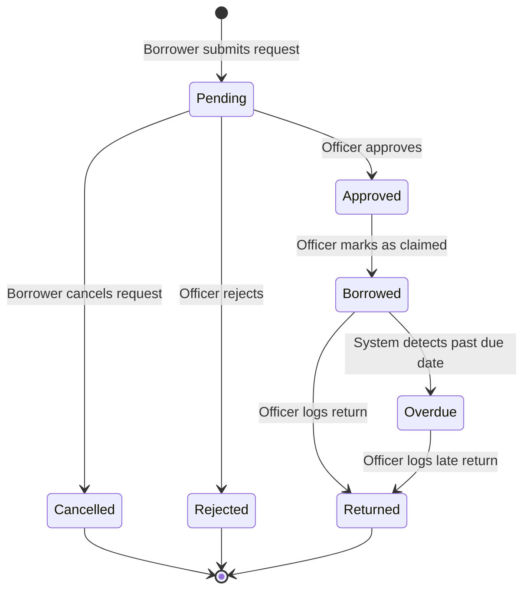

# Borrowing Workflow

The system enforces a strict 7-status workflow for borrowing equipment.

## State Transitions
1. **Pending**: Initial state when a request is made.
2. **Approved**: The Officer has approved the request, reserving the equipment.
3. **Borrowed**: The Borrower has claimed the equipment and is currently using it.
4. **Returned**: The equipment has been successfully returned and is Available again.
5. **Overdue**: The system automatically detects that the current date exceeds the due date.
6. **Rejected**: The Officer denied the request.
7. **Cancelled**: The Borrower cancelled their own request before approval.
